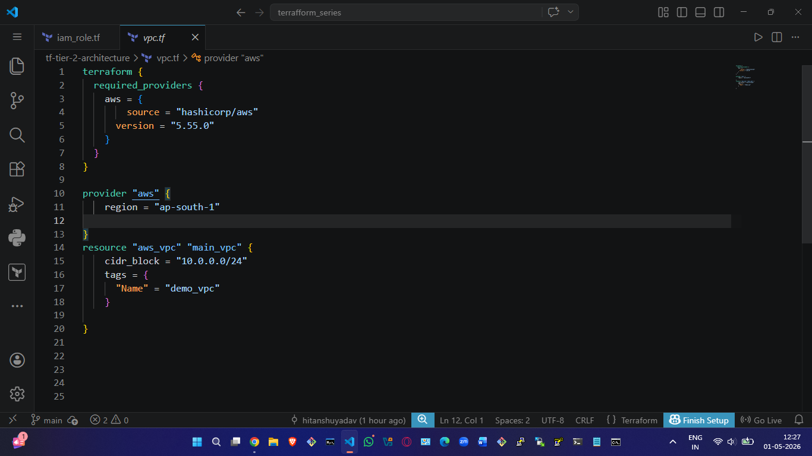
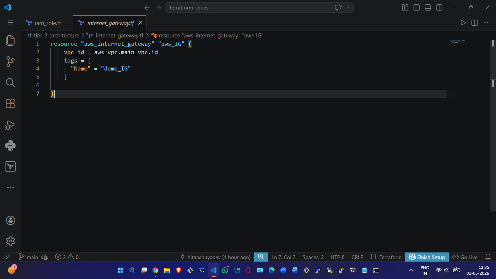
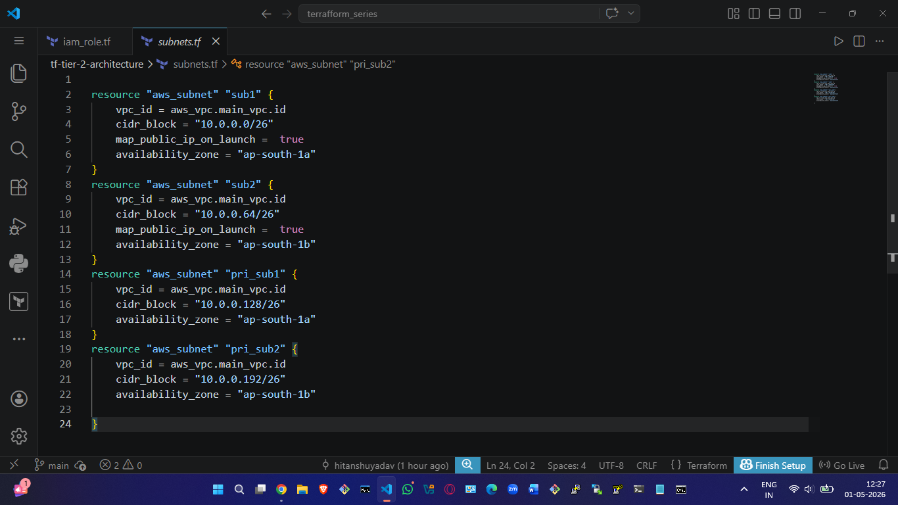
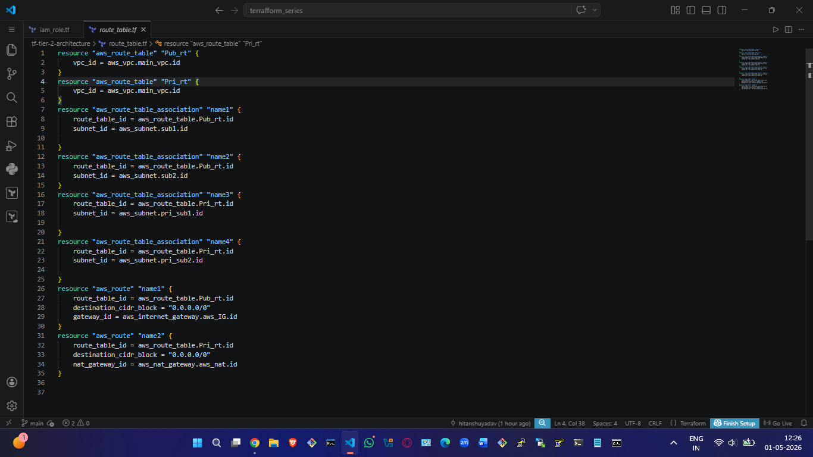
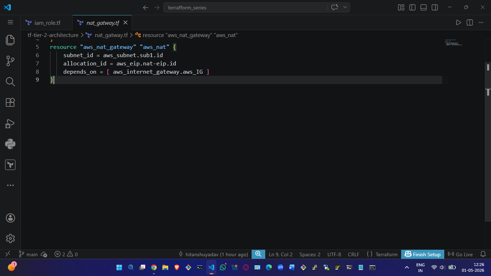
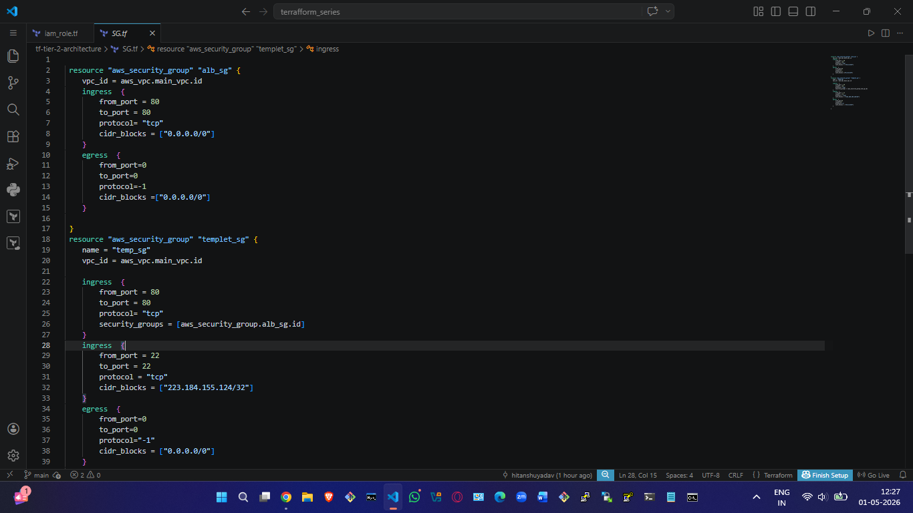
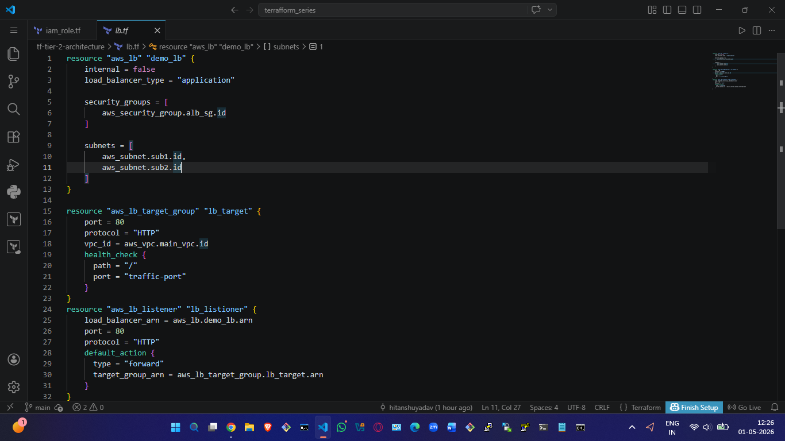
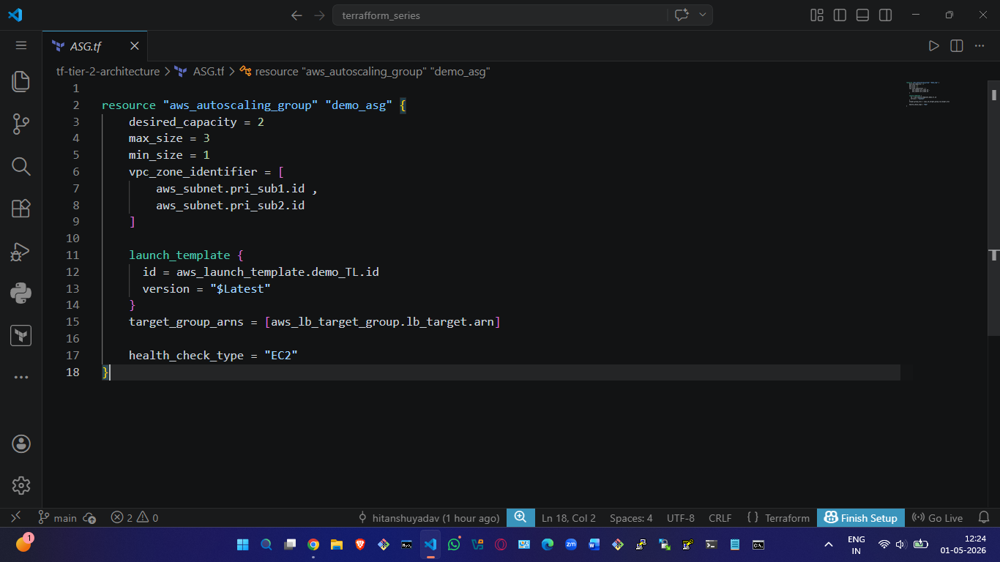
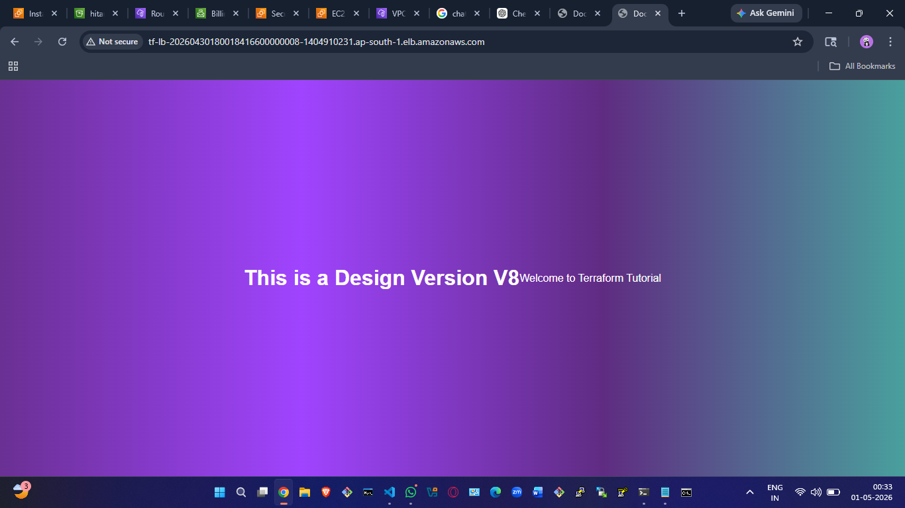

  # Terraform Tier-2 Architecture on AWS

## Project Overview

This project demonstrates how to build a complete Tier-2 Architecture on AWS using Terraform.

The infrastructure includes:

* VPC
* Public and Private Subnets
* Internet Gateway
* Route Tables
* NAT Gateway
* Security Groups
* Launch Template
* Auto Scaling Group
* Application Load Balancer
* EC2 Instances

---

 
---

# Step 1 — Create VPC

## Description

The VPC is the main network container that holds all AWS resources.

### Terraform Code

```hcl
# Pasteterraform {
  required_providers {
    aws = { 
        source = "hashicorp/aws"
      version = "5.55.0"
    }
  }
}

provider "aws" {
    region = "ap-south-1"

}
resource "aws_vpc" "main_vpc" {
    cidr_block = "10.0.0.0/24"
    tags = {
      "Name" = "demo_vpc" 
    }
  
}

 
```

### Output Screenshot





### Explanation

* Created a custom VPC
* Enabled DNS support
* CIDR block used for private networking

---

# Step 2 — Create Internet Gateway

## Description

The Internet Gateway allows public subnet resources to access the internet.

### Terraform Code

```hcl
 resource "aws_internet_gateway" "aws_IG" {
    vpc_id = aws_vpc.main_vpc.id
    tags = {
      "Name" = "demo_IG" 
    }
  
}
```

### Output Screenshot





### Explanation

* Attached Internet Gateway to VPC
* Enables internet connectivity

---

# Step 3 — Create Public and Private Subnets

## Description

Subnets divide the VPC network into smaller sections.

### Terraform Code

```hcl
resource "aws_subnet" "sub1" {
    vpc_id = aws_vpc.main_vpc.id
    cidr_block = "10.0.0.0/26"
    map_public_ip_on_launch =  true
    availability_zone = "ap-south-1a"
}
resource "aws_subnet" "sub2" {
    vpc_id = aws_vpc.main_vpc.id
    cidr_block = "10.0.0.64/26"
    map_public_ip_on_launch =  true
    availability_zone = "ap-south-1b"
}
resource "aws_subnet" "pri_sub1" {
    vpc_id = aws_vpc.main_vpc.id
    cidr_block = "10.0.0.128/26"
    availability_zone = "ap-south-1a"
}
resource "aws_subnet" "pri_sub2" {
    vpc_id = aws_vpc.main_vpc.id
    cidr_block = "10.0.0.192/26"
    availability_zone = "ap-south-1b"
   
}
```
### Output Screenshot




### Explanation

* Created public subnet for Load Balancer
* Created private subnet for application servers
* Used multiple Availability Zones

---

# Step 4 — Create Route Tables

## Description

Route tables control network traffic inside the VPC.

### Terraform Code

```hcl
 resource "aws_route_table" "Pub_rt" {
    vpc_id = aws_vpc.main_vpc.id
}
resource "aws_route_table" "Pri_rt" {
    vpc_id = aws_vpc.main_vpc.id
}
resource "aws_route_table_association" "name1" {
    route_table_id = aws_route_table.Pub_rt.id
    subnet_id = aws_subnet.sub1.id
    
}
resource "aws_route_table_association" "name2" {
    route_table_id = aws_route_table.Pub_rt.id
    subnet_id = aws_subnet.sub2.id  
}
resource "aws_route_table_association" "name3" {
    route_table_id = aws_route_table.Pri_rt.id
    subnet_id = aws_subnet.pri_sub1.id
    
}
resource "aws_route_table_association" "name4" {
    route_table_id = aws_route_table.Pri_rt.id
    subnet_id = aws_subnet.pri_sub2.id
    
}
resource "aws_route" "name1" {
    route_table_id = aws_route_table.Pub_rt.id
    destination_cidr_block = "0.0.0.0/0"
    gateway_id = aws_internet_gateway.aws_IG.id
} 
resource "aws_route" "name2" {
    route_table_id = aws_route_table.Pri_rt.id
    destination_cidr_block = "0.0.0.0/0"
    nat_gateway_id = aws_nat_gateway.aws_nat.id
}


```

### Output Screenshot





### Explanation

* Public route table connected to Internet Gateway
* Private route table connected to NAT Gateway

---

# Step 5 — Create NAT Gateway

## Description

NAT Gateway allows private instances to access the internet securely.

### Terraform Code

```hcl
 
resource "aws_eip" "nat-eip" {

  domain = "vpc"
}
resource "aws_nat_gateway" "aws_nat" {
    subnet_id = aws_subnet.sub1.id
    allocation_id = aws_eip.nat-eip.id
    depends_on = [ aws_internet_gateway.aws_IG ]
}
```
### Output Screenshot





### Explanation

* NAT Gateway deployed in public subnet
* Elastic IP attached
* Used for outbound internet traffic from private subnet

---

# Step 6 — Create Security Groups

## Description

Security Groups act as virtual firewalls.

### Terraform Code

```hcl
  
 resource "aws_security_group" "alb_sg" {
    vpc_id = aws_vpc.main_vpc.id
    ingress  {
        from_port = 80
        to_port = 80
        protocol= "tcp"
        cidr_blocks = ["0.0.0.0/0"]
    }
    egress  {
        from_port=0
        to_port=0
        protocol=-1
        cidr_blocks =["0.0.0.0/0"]
    }
   
 }
 resource "aws_security_group" "templet_sg" {
    name = "temp_sg"
    vpc_id = aws_vpc.main_vpc.id

    ingress  {
        from_port = 80
        to_port = 80
        protocol= "tcp"
        security_groups = [aws_security_group.alb_sg.id]
    }
    ingress  {
        from_port = 22
        to_port = 22
        protocol = "tcp"
        cidr_blocks = ["223.184.155.124/32"]
    }
    egress  {
        from_port=0
        to_port=0
        protocol="-1"
        cidr_blocks = ["0.0.0.0/0"]
    }
   
 }
  

```

### Output Screenshot





### Explanation

* Allowed HTTP traffic
* Allowed SSH access
* Restricted private communication

---

# Step 7 — Create Launch Template

## Description

Launch Template defines EC2 configuration for Auto Scaling.

### Terraform Code

```hcl
  resource "aws_launch_template" "demo_TL" {
    
   image_id = data.aws_ami.ami.id
   instance_type = "t3.micro"
   vpc_security_group_ids = [ aws_security_group.templet_sg.id ]
   user_data = base64encode(<<-EOF
   #!/bin/bash

   sudo apt update

   sudo systemctl start nginx

   aws s3 sync s3://${aws_s3_bucket.s3.bucket} /var/www/html

   EOF
    )

   iam_instance_profile  {
    name = aws_iam_instance_profile.instance_profile.name
   }
   
 }
 

  

```

### Output Screenshot


### Explanation

* Selected AMI
* Added user data script
* Attached Security Group
* Defined instance type

---

# Step 8 — Create Application Load Balancer

## Description

Application Load Balancer distributes traffic across instances.

### Terraform Code

```hcl
 resource "aws_lb" "demo_lb" {
    internal = false
    load_balancer_type = "application"

    security_groups = [
        aws_security_group.alb_sg.id
    ]

    subnets = [
        aws_subnet.sub1.id,
        aws_subnet.sub2.id
    ]
}

resource "aws_lb_target_group" "lb_target" {
    port = 80
    protocol = "HTTP"
    vpc_id = aws_vpc.main_vpc.id
    health_check {
      path = "/"
      port = "traffic-port"
    }
}
resource "aws_lb_listener" "lb_listioner" {
    load_balancer_arn = aws_lb.demo_lb.arn
    port = 80
    protocol = "HTTP"
    default_action {
      type = "forward"
      target_group_arn = aws_lb_target_group.lb_target.arn
    }
}
```

### Output Screenshot




### Explanation

* Created internet-facing ALB
* Added listener on port 80
* Connected target group

---

# Step 9 — Create Auto Scaling Group

## Description

Auto Scaling automatically launches or terminates EC2 instances.

### Terraform Code

```hcl
 
resource "aws_autoscaling_group" "demo_asg" {
    desired_capacity = 2
    max_size = 3
    min_size = 1
    vpc_zone_identifier = [
        aws_subnet.pri_sub1.id ,
        aws_subnet.pri_sub2.id
    ]

    launch_template {
      id = aws_launch_template.demo_TL.id
      version = "$Latest"
    }
    target_group_arns = [aws_lb_target_group.lb_target.arn]

    health_check_type = "EC2"
}
```

### Output Screenshot




### Explanation

* Attached Launch Template
* Configured desired capacity
* Enabled multi-AZ deployment

---

# Step 10 — Deploy EC2 Application

## Description

Application deployed through user data script.

### Terraform Code

```hcl
  
   resource "aws_launch_template" "demo_TL" {
    
   image_id = data.aws_ami.ami.id
   instance_type = "t3.micro"
   vpc_security_group_ids = [ aws_security_group.templet_sg.id ]
   user_data = base64encode(<<-EOF
   #!/bin/bash

   sudo apt update

   sudo systemctl start nginx

   aws s3 sync s3://${aws_s3_bucket.s3.bucket} /var/www/html

   EOF
    )

   iam_instance_profile  {
    name = aws_iam_instance_profile.instance_profile.name
   }
   
 }
 

  

```

### Output Screenshot




### Explanation

* Installed web server
* Hosted sample application
* Verified through Load Balancer DNS

# Commands Used

## Initialize Terraform

```bash
terraform init
```

## Validate Terraform

```bash
terraform validate
```

## Preview Infrastructure

```bash
terraform plan
```

## Create Infrastructure

```bash
terraform apply
```

## Destroy Infrastructure

```bash
terraform destroy
```

---

# Folder Structure

```text
project/
├── provider.tf
├── vpc.tf
├── subnet.tf
├── route.tf
├── nat.tf
├── security.tf
├── alb.tf
├── asg.tf
├── launch-template.tf
├── variables.tf
├── outputs.tf
├── userdata.sh
├── README.md
└── screenshots/
```

---

# Author

Hitanshu Yadav

Cloud & DevOps Enthusiast
